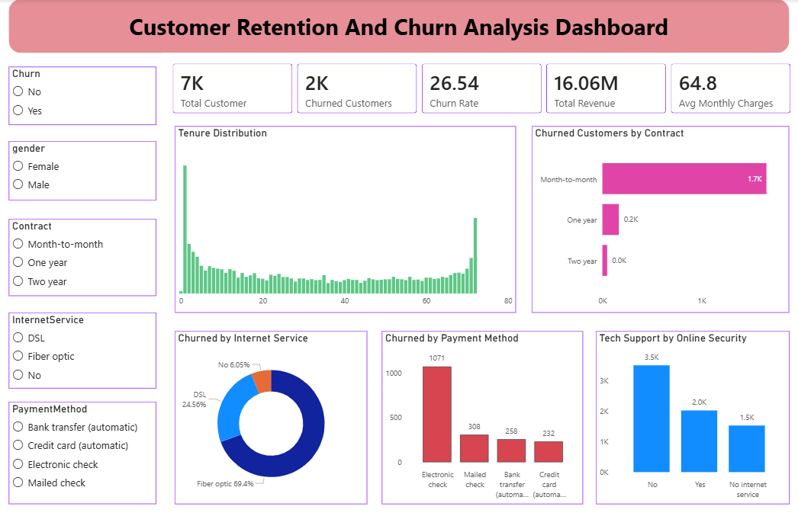

# 📊 Customer Retention & Churn Analysis Dashboard

> A business intelligence dashboard built with **Microsoft Power BI** as part of the **FutureInterns Data Science & Analytics Internship Program - Task 2**.

---

## 🖼️ Dashboard Preview



---

## 📌 Project Overview

This project analyzes **Telco customer churn data** to understand why customers leave and what keeps them engaged. The goal is to help business teams make data-driven decisions to reduce churn, improve retention, and grow revenue.

This type of analysis is core to **SaaS companies, startups, and subscription-based businesses** where reducing churn directly improves long-term growth.

---

## 🎯 Business Questions Answered

- Why are customers leaving the platform?
- Which customer segments are most likely to churn?
- How long do customers typically stay before churning?
- Which payment methods and services are linked to high churn?
- What actions can the business take to improve retention?

---

## 📈 Key Metrics

| KPI | Value |
|-----|-------|
| 👥 Total Customers | 7,043 |
| ❌ Churned Customers | 1,869 (~2K) |
| 📉 Churn Rate | 26.54% |
| 💰 Total Revenue | 16.06M |
| 💳 Avg Monthly Charges | $64.8 |

---

## 🗂️ Dashboard Visuals

| Visual | Description |
|--------|-------------|
| KPI Cards | Total customers, churned count, churn rate, revenue, avg charges |
| Tenure Distribution | Column chart showing churned vs retained by months of tenure |
| Churned by Contract Type | Bar chart : Month-to-month vs One year vs Two year |
| Churned by Internet Service | Donut chart : Fiber Optic, DSL, No Internet |
| Churned by Payment Method | Bar chart : Electronic Check, Mailed Check, Auto payments |
| Tech Support by Online Security | Bar chart showing retention impact of support services |
| Slicers | Interactive filters for Churn, Gender, Contract, Internet Service, Payment Method |

---

## 🛠️ Tools Used

- **Microsoft Power BI Desktop** - Dashboard & visualizations
- **Microsoft Excel / CSV** - Data preparation
- **Kaggle** - Dataset source

---

## 🔍 Key Insights

- **Month-to-month** customers churn at **42.7%** - nearly 4x higher than two-year contracts (2.8%)
- **Electronic Check** users have the highest churn rate at **45.3%**
- **Fiber Optic** customers account for **69.4%** of all churned customers
- Customers **without tech support** show the highest churn risk
- **Senior citizens** churn at **41.7%** vs 23.6% for non-seniors
- Most churn happens in the **first 0–12 months** of tenure

---

## 💡 Strategic Recommendations

- Migrate month-to-month users to annual plans with discount incentives
- Incentivize automatic payment methods to reduce manual payment churn
- Investigate Fiber Optic service quality and review pricing
- Proactively offer tech support to new customers during onboarding
- Focus retention campaigns on customers in months 1–12

---

## 📁 Repository Structure

```
📦 FUTURE_DS_02
 ┣ 📊 PowerBI_dashboard.pbix               # Power BI Dashboard file
 ┣ 📄 Churn_Analysis_Report. pdf            # Full analysis report
 ┣ 📄 Telco-Customer-Churn.csv                # Dataset used
 ┣ 🖼️ dashboard.png                        # Dashboard screenshot
 ┗ 📄 README.md                          # Project documentation
```

---

## 🚀 How to Use

1. Clone this repository
   ```bash
   git clone https://github.com/sourabhsharma140107-cloud/customer-churn-analysis.git
   ```
2. Open `PowerBI_dashboard.pbix` in **Power BI Desktop**
3. Refresh data if needed by pointing to `Telco-Customer-Churn.csv`
4. Use the slicers to explore churn by segment interactively!

---

## 🎓 Internship Details

- **Program:** FutureInterns Data Science & Analytics Internship
- **Task:** Task 2 - Customer Retention & Churn Analysis
- **Skills Demonstrated:** Churn analysis, cohort segmentation, KPI dashboards, retention strategy, business storytelling

---

